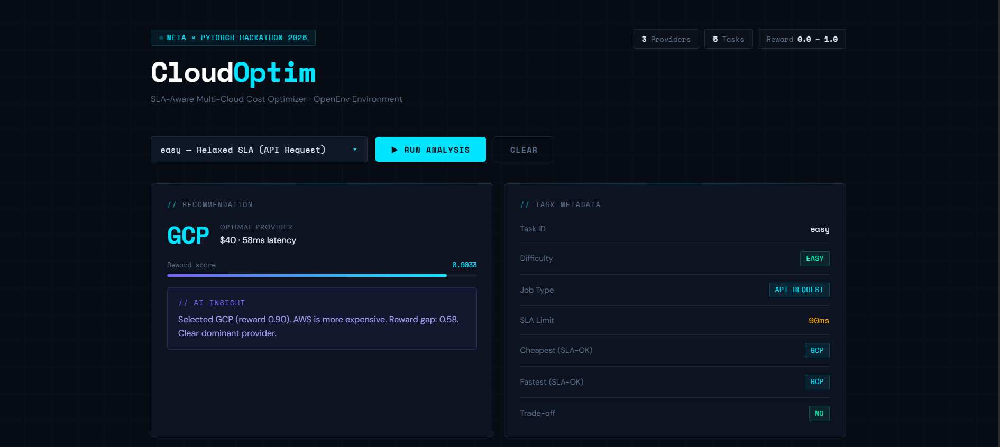
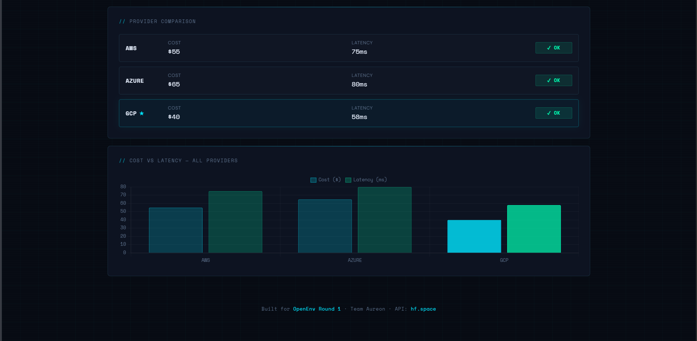

# 🚀 AI-Powered SLA-Aware Multi-Cloud Optimization Environment

> 🚀 Simulates real-world cloud routing decisions under practical SLA constraints using an AI-driven environment.

An OpenEnv-compatible system where agents optimize:

👉 **Cost vs Latency vs SLA trade-offs** across AWS, Azure, and GCP  

Built for the **Meta × PyTorch Hackathon 2026**

---

## 📸 UI Preview (Live Dashboard)

### 🧠 Recommendation + Task Insights


### 📊 Provider Comparison + Visualization


---

## 💡 Problem

Modern cloud systems must make complex decisions.

Choosing the cheapest provider is not enough — systems must balance:

- SLA (latency constraints)  
- Cost efficiency  
- Dynamic cloud conditions  

Traditional rule-based approaches fail to handle these trade-offs effectively.

---

## 💡 Solution

We model cloud routing as a **decision-making environment**.

Agents interact with the system by:

- Observing cloud conditions  
- Selecting a provider  
- Receiving a reward based on performance  

This enables intelligent optimization of real-world cloud decisions.

---

## 🤖 AI Component

- Reinforcement learning structure:
  - **State → Action → Reward**
- Continuous reward system (not binary)
- Deterministic evaluation (grading system)
- Supports intelligent agents (LLM / RL)

---

## 🎯 Key Features

- 🌐 Interactive Dashboard UI
- 📊 Scatter Plot Visualization (Cost vs Latency)
- 🧠 AI-generated insights & reasoning
- ⚡ Real-time provider comparison
- 🎯 SLA-aware optimization
- ⭐ Automatic best provider recommendation
- 📈 Clear cost vs latency trade-off visualization

---

## 📊 Example Output

```json
{
  "selected_cloud": "gcp",
  "latency": 58,
  "cost": 40,
  "sla_max_latency": 90,
  "reward": 0.9033,
  "grade": "excellent"
}
```

---

## 📈 Visualization Insight

- X-axis → Cost 💰  
- Y-axis → Latency ⚡  
- Each dot → Cloud provider  
- Highlighted point → Optimal choice  

👉 Helps clearly identify:
- Trade-offs  
- Best provider  
- SLA-safe region  

---

## 🌐 Live Demo

👉 https://nityanama-multi-cloud-optimizer.hf.space/

---

## 📁 Project Structure

```
multi_cloud_optimizer/
├── app.py
├── inference.py
├── Dockerfile
├── requirements.txt
└── README.md
```

---

## ⚡ Quickstart

### Run Locally

```bash
git clone https://huggingface.co/spaces/nityanama/multi_cloud_optimizer
cd multi_cloud_optimizer
pip install -r requirements.txt
python app.py
```

---

## 🧠 How It Works

```python
observation = env.reset()
action = agent.act(observation)
obs, reward, done, info = env.step(action)
```

---

## 🏆 Reward Function

```python
reward = 0.0  # if SLA violated
reward = 0.75 * cost_score \
       + 0.15 * latency_headroom_ratio \
       + 0.10 * efficiency_bonus
```

---

## 🔍 Explainability

- `/insights/{task}` → AI reasoning  
- `/compare/{task}` → provider comparison  
- `/what_if/{task}` → counterfactual analysis  

---

## 📊 Impact

- AI-based cloud optimization systems  
- Reinforcement learning experimentation  
- DevOps / FinOps intelligent systems  
- Benchmark for AI reasoning  

---

## 🔮 Future Scope

- Multi-step decision environments  
- Dynamic pricing simulation  
- Multi-region cloud modeling  
- RL training (PPO/DQN)  
- Multi-agent benchmarking  

---

## 📄 License

MIT — free to use for research and hackathons
